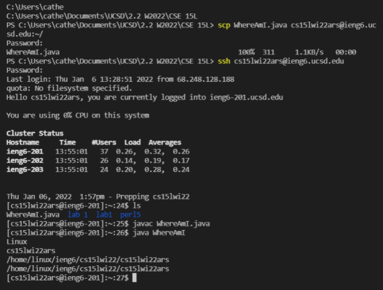

# **Lab Report 1: Remote Access**

## Installing VSCode
To install VSCode, go to the [VSCode website](https://code.visualstudio.com/) and click the download button for Windows. Follow the download instructions and after opening the VSCode, you should see a screen like this:
  

---
## Remotely Connecting
After installing the OpenSSH program and finding your [course account](https://sdacs.ucsd.edu/~icc/index.php) for the course, open VSCode and click Terminal, then New Terminal from the top menu bar. This will open up a powershell terminal at the bottom of the screen. 
   
In the terminal, type `ssh cs15lwi22ars@ieng6.ucsd.edu` to begin the connection to the ucsd server (Make sure to replace the last three letters before the @ with your course-specific account letters).
   
The terminal will then prompt you for the password for your account. When entering your password, you may notice that nothing appears after `Password:` as you type. THIS IS NORMAL! Once the password is typed in, press enter and you should be logged into the ssh and connected to the server.
   
Your terminal should look like this:    

---
## Trying Some Commands
You can use many commands in the terminal including, but not limited to the following:  
- `cd` : changes working directory
- `cd ..` : change directory back to the parent directory of the current directory
- `pwd` : print working directory
- `ls` : lists all files and directories under current directory
- `mkdir` : make new directory

 
Here is an example of using some of the commands in the terminal: 
   

 

---
## Moving Files with scp
In order to move files into ssh, we need to utilize the command `scp`. Make sure you are not logged into your ssh and create a java file locally(The file used is `WhereAmI.java`). 
   
In the terminal, type in the command `scp WhereAmI.java cs15lwi2ars@ieng6.ucsd.edu:~/`. 
   
Fill in the password for your ssh like before and the `WhereAmI.java` file should be copied into the remote computer. After running this command the terminal should look like this: 
   

---
## Setting an SSH Key

---
## Optimizing Remote Running
---