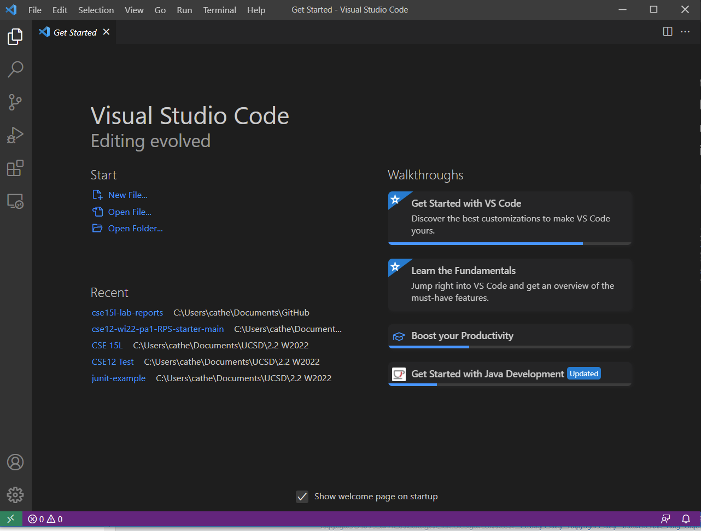

# **Lab Report 1: Remote Access**

## **Installing VSCode**
To install VSCode, go to the [VSCode website](https://code.visualstudio.com/) and click the download button for Windows. Follow the download instructions and after opening the VSCode, you should see a screen like this:
  

---

## **Remotely Connecting**
After installing the OpenSSH program and finding your [course account](https://sdacs.ucsd.edu/~icc/index.php) for the course, open VSCode and click Terminal, then New Terminal from the top menu bar. This will open up a powershell terminal at the bottom of the screen. 
   
In the terminal, type `ssh cs15lwi22ars@ieng6.ucsd.edu` to begin the connection to the ucsd server (Make sure to replace the last three letters before the @ with your course-specific account letters).
   
The terminal will then prompt you for the password for your account. When entering your password, you may notice that nothing appears after `Password:` as you type. THIS IS NORMAL! Once the password is typed in, press enter and you should be logged into the ssh and connected to the server.
   
Your terminal should look like this:    

---
## Trying Some Commands
---
## Moving Files with scp
---
## Setting an SSH Key
---
## Optimizing Remote Running
---