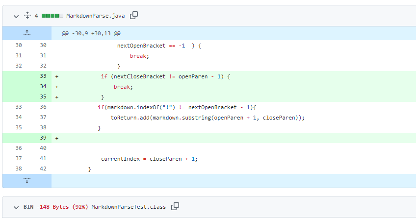
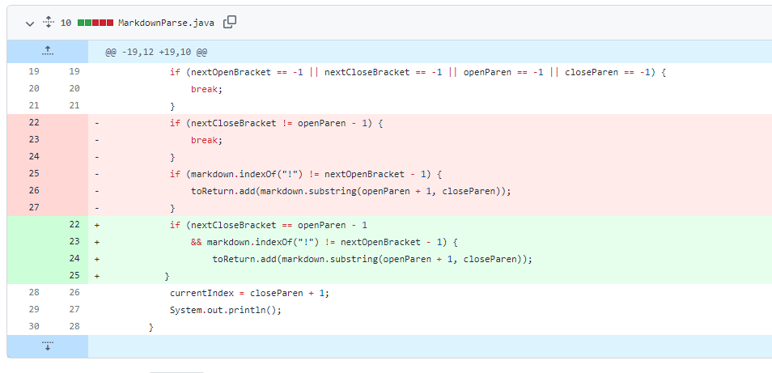

# **Lab Report 2: Bugs and Symptoms**

## Code Change 1: test-file4.md

<br />

**Link to failure-inducing input:** [test-file4.md](https://github.com/CatherineGu16/markdown-parse/blob/main/test-file4.md)

**Symptoms in running main:** <br />
```
PS C:\Users\cathe\Documents\GitHub\markdown-parse> javac MarkdownParse.java
PS C:\Users\cathe\Documents\GitHub\markdown-parse> java MarkdownParse test-file4.md
[43245.jpg, https://something.com]
```

**Symptoms in running jUnit Tester:** <br />
```
There was 1 failure:
1) parseTest4(MarkdownParseTest)
java.lang.AssertionError: expected:<[https://something.com]> but was:<[43245.jpg, https://something.com]>
        at org.junit.Assert.fail(Assert.java:89)
        at org.junit.Assert.failNotEquals(Assert.java:835)
        at org.junit.Assert.assertEquals(Assert.java:120)
        at org.junit.Assert.assertEquals(Assert.java:146)
        at MarkdownParseTest.parseTest4(MarkdownParseTest.java:34)

FAILURES!!!
Tests run: 3,  Failures: 1
```
**Description:** <br />
In this code change, we saw from running both the main method in MarkdownParse.java and the jUnit test for test-file4.md, that an image was incorrectly added to our list of links. The bug was that in our code, we did not check for a "!" before the bracket, which indicates that the following code is for inserting an image. This bug caused test-file4.md to fail the tester because the syntax between an image and a link is differentiated by a `!` before the opening bracket, and because this was not originally addressed, the image was treated like a link and added to our list.

## Code Change 2: test-file6.md

<br />

**Link to failure-inducing input:** [test-file6.md](https://github.com/CatherineGu16/markdown-parse/blob/main/test-file6.md)

**Symptoms in running main:** 
```
PS C:\Users\cathe\Documents\GitHub\markdown-parse> javac MarkdownParse.java
PS C:\Users\cathe\Documents\GitHub\markdown-parse> java MarkdownParse test-file6.md
[page.com]
```

**Symptoms in running jUnit Tester:** <br />
```
There was 1 failure:
1) parseTest6(MarkdownParseTest)
java.lang.AssertionError: expected:<[]> but was:<[page.com]>
        at org.junit.Assert.fail(Assert.java:89)
        at org.junit.Assert.failNotEquals(Assert.java:835)
        at org.junit.Assert.assertEquals(Assert.java:120)
        at org.junit.Assert.assertEquals(Assert.java:146)
        at MarkdownParseTest.parseTest6(MarkdownParseTest.java:43)

FAILURES!!!
Tests run: 4,  Failures: 1
```

**Description:** <br />
The symptom of this bug was the incorrect addition of `[page.com]` to the list of links. In test-file6.md, there is the word "paragraph" between the set of brackets and the set of parentheses, which means it should not be categorized as a link. The bug in our program was that we did not account for the syntaxical structure of links in that the character right after the closing bracket must be the open parentheses.

## Code Change 3: test-file6edit.md

<br />

**Link to failure-inducing input:** [test-file6edit.md](https://github.com/CatherineGu16/markdown-parse/blob/main/test-file6edit.md)

**Symptoms in running main:** 
```
PS C:\Users\cathe\Documents\GitHub\markdown-parse> javac MarkdownParse.java
PS C:\Users\cathe\Documents\GitHub\markdown-parse> java MarkdownParse test-file6edit.md
[]
```

**Symptoms in running jUnit Tester:** <br />
```
There was 1 failure:
1) parseTest6edit(MarkdownParseTest)
java.lang.AssertionError: expected:<[test.com]> but was:<[]>
        at org.junit.Assert.fail(Assert.java:89)
        at org.junit.Assert.failNotEquals(Assert.java:835)
        at org.junit.Assert.assertEquals(Assert.java:120)
        at org.junit.Assert.assertEquals(Assert.java:146)
        at MarkdownParseTest.parseTest6edit(MarkdownParseTest.java:53)

FAILURES!!!
Tests run: 5,  Failures: 1
```

**Description:** <br />
The symptoms of this failure was that the output for testing this file returned an empty list instead of the valid link that was at the very end of this file. Because the file had an invalid link before the valid link, our original code had a `break;` statement that stopped our function immediately after finding some part of the code not syntaxically aligned with that of a link. Therefore, the bug stopped the code before it reached the end of the file, meaning it missed the valid link at the end.