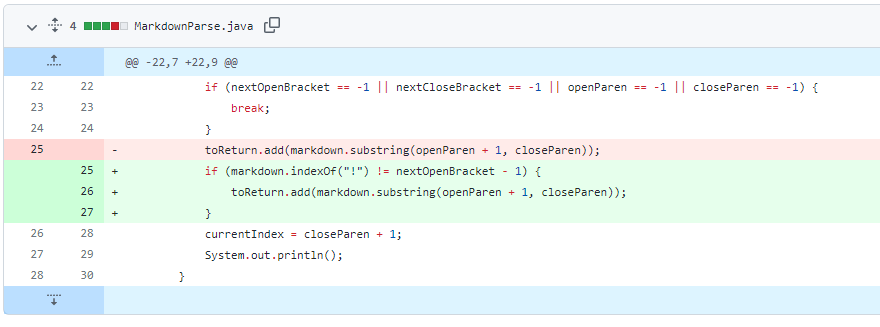

# **Lab Report 2: Bugs and Symptoms**

## Code Change 1:

<br />

[Link to test-file4.md](https://github.com/CatherineGu16/markdown-parse/blob/main/test-file4.md)

**Symptoms in running main:** `[43245.jpg, https://something.com]` <br />
**Symptoms in running jUnit Tester:** <br />
```
JUnit version 4.13.2
.

..
E
Time: 0.012
There was 1 failure:
1) parseTest4(MarkdownParseTest)
java.lang.AssertionError: expected:<[https://something.com]> but was:<[43245.jpg, https://something.com]>
        at org.junit.Assert.fail(Assert.java:89)
        at org.junit.Assert.failNotEquals(Assert.java:835)
        at org.junit.Assert.assertEquals(Assert.java:120)
        at org.junit.Assert.assertEquals(Assert.java:146)
        at MarkdownParseTest.parseTest4(MarkdownParseTest.java:34)

FAILURES!!!
Tests run: 3,  Failures: 1
```

In this code change, I saw from running both the main method in MarkdownParse.java and the jUnit test for test-file4.md, that an image was incorrectly added to our list of links. The bug was that in our code, we did not check for a "!" before the bracket, which indicates that the following code is for inserting an image. This bug caused test-file4.md to fail the tester because the syntax between an image and a link is only differentiated by a `!` before the opening bracket, resulting in the image being treated like a link and, thus added to our list.
