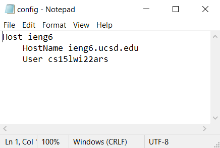
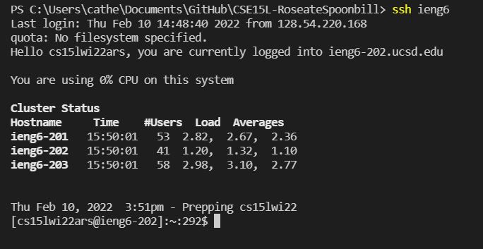
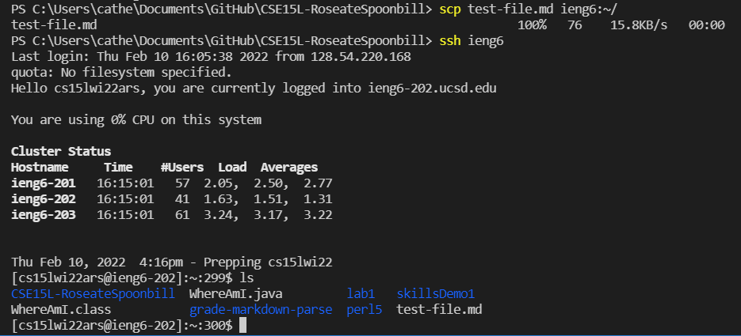

# **Lab Report 3: ssh Streamlining**

## .ssh/config file

 

Because I work on a Windows machine and do not have Vim, I needed to manually go into my file explorer and create a new file in my .ssh folder. I named the file "config" and typed in the appropriate lines shown in the image above using Notepad. I named my alias `ieng6` and put my cs15l username as User.
 

## ssh command

 

In this image, I demonstrate running ssh using the alias I created in the previous step. The terminal runs and logs me into my ssh account without needing me to input my username or password.
 

## scp command

 

This image shows how I copied a file (test-file.md) into my ssh account using `ieng6` and not my full username. Then I logged into my ssh account and checked to make sure that the file was indeed copied in.